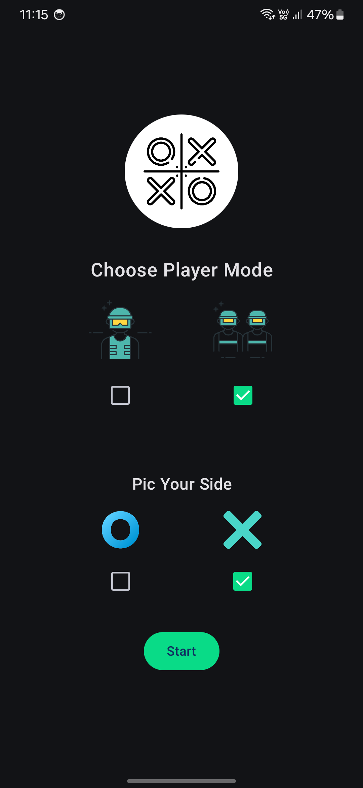
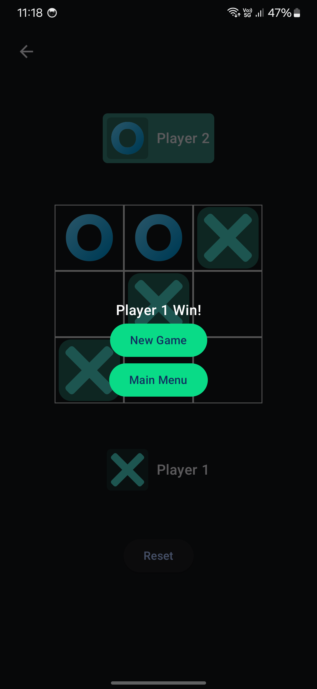
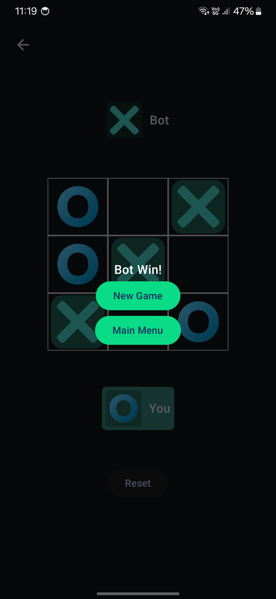
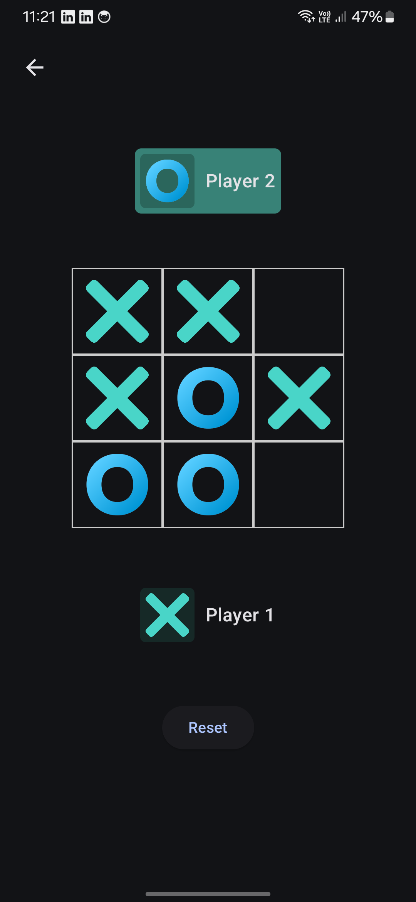

  
  <h3 align="center">Tic Tac Toe Game</h3>

Tic Tac Toe game with single and duo player

## Screenshots

  
  
  
  

<a href="https://drive.google.com/file/d/10Y2T4wJWKKYJZtM9XWoOvBc14Njj0KlT/view?usp=sharing" >  Download Game</a>

